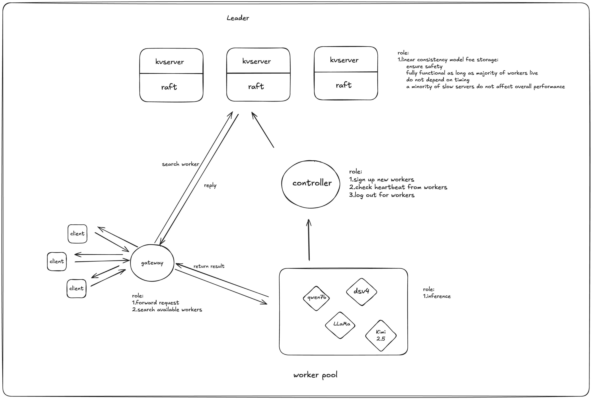

# 基于raft实现的分布式ai推理控制面

## 项目架构

**Raft KV**
**Gateway**
**Mock Worker**

## 项目流程
用户请求
  |
  v
Gateway 网关：决定请求发给哪个模型服务
  |
  v
Worker：真正处理请求
  |
  v
Raft KV：保存系统状态

## 技术特性

**强一致性存储**
**故障容错**
**负载均衡**

## 项目流程

**phase1**:
实现功能：kvserver提供基本API：Put，Get，Delete。以供controller调用来注册和修改workers状态
~~~go
Put(key, value)
Get(key)
Delete(key)
~~~

逻辑链路：controller注册 -> kvserver记录

具备快照(snapshot)功能

**phase2**：
逻辑链路 ：员工注册 --> controller记录 --> 存入kvserver   

实现功能：
controller提供提供记录接口

~~~http
POST /workers/register
POST /workers/heartbeat
GET  /workers
~~~

员工定期发送心跳(heartbeat)，如果controller一定时间未收到，则将员工标记为unhealthy状态

**phase3**:

实现功能：worker提供接口，模仿推理

~~~http
POST /v1/chat/completions
~~~

**phase4**

实现功能：gateway提供访问API，用户可以访问gateway -> gateway选择worker -> 调用worker API -> gateway转发结果   

~~~http
POST /v1/chat/completions
~~~

**phase5**:

