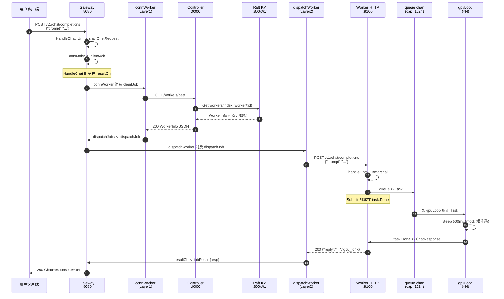
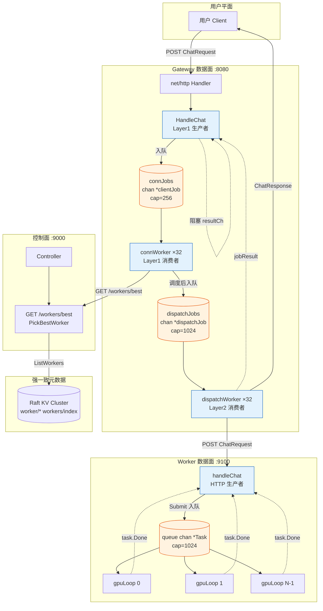

# AIFS Phase 3 — 数据面技术文档

> 范围：用户 `POST /v1/chat/completions` → Gateway（双层队列）→ Controller 选 Worker → Worker 推理池（Channel + GPU 协程）→ 原路返回。  
> 控制面 KV/Raft 仅在 Worker **注册/心跳** 时参与，推理路径不经过 `kvraft`。

---

## 1. 端到端数据流向链路（Data Flow Chain）

以下以一次成功的 Chat 请求为例，按**字节/语义载体**在组件间的流转顺序描述。

### 阶段 0：前置条件（进程已启动）

| 组件 | 监听 | 持久化状态 |
|------|------|------------|
| `kvcluster` | `:8001~8003` `/kv` | Raft KV 存 `worker/{id}`、`workers/index` |
| `controller` | `:9000` | 内存 `seen` / `lastseen` + 读 KV |
| `worker` | `:9100` `/v1/chat/completions` | 本地 `queue chan *Task`（cap=1024）+ N 个 `gpuLoop` |
| `gateway` | `:8080` `/v1/chat/completions` | `connJobs`(256) + `dispatchJobs`(1024) + 协程池 |

---

### 阶段 1：用户 → Gateway（HTTP 入站）

| 步骤 | 位置 | 动作 | 数据形态 |
|------|------|------|----------|
| 1.1 | 用户客户端 | `POST http://gateway:8080/v1/chat/completions` | HTTP Body: `{"prompt":"hello AIFS"}` |
| 1.2 | `net/http` | 内核 TCP 收包 → Go `http.Server` 派发到 handler goroutine | 原始 HTTP 帧 |
| 1.3 | `gateway.ServeHTTP` | 路径匹配 `/v1/chat/completions` | — |
| 1.4 | `gateway.HandleChat` | `io.ReadAll(r.Body)` | `[]byte` JSON |
| 1.5 | `json.Unmarshal` | 解析为 `models.ChatRequest` | 内存结构体 `{Prompt: "hello AIFS"}` |
| 1.6 | 校验 | `Prompt != ""`，否则 400 | — |
| 1.7 | 构造 Layer1 作业 | `clientJob{prompt, resultCh}` | `resultCh` 为 cap=1 的 `chan jobResult` |
| 1.8 | **生产者入队** | `g.connJobs <- job`（Layer1 队列，缓冲 256） | 指针 `*clientJob` |
| 1.9 | **阻塞等待** | `HandleChat` 在 `<-job.resultCh` 上阻塞 | 当前 HTTP goroutine 挂起，连接保持 |

**日志**：`[Gateway] recv user request` → `enqueued conn job`

---

### 阶段 2：Gateway Layer1 — 连接分发（connWorker 消费 `connJobs`）

| 步骤 | 位置 | 动作 | 数据形态 |
|------|------|------|----------|
| 2.1 | `connWorker(i)` | 从 `connJobs` 取出 `*clientJob` | 拿到 `job.prompt` 字符串 |
| 2.2 | `pickWorker()` | 准备调度 | — |
| 2.3 | `http.Client.Get` | `GET {controller}/workers/best` | **HTTP 出站**（无 Body） |
| 2.4 | Controller 侧 | 见「阶段 3」 | 响应 Body: `WorkerInfo` JSON |
| 2.5 | `json.Decode` | 得到 `models.WorkerInfo` | `{ID, IP, Port, GPUs, Status}` |
| 2.6 | 构造 Layer2 作业 | `dispatchJob{prompt, worker, resultCh}` | **共享** Layer1 的 `resultCh` |
| 2.7 | **生产者入队** | `g.dispatchJobs <- djob`（Layer2 队列，缓冲 1024） | 指针 `*dispatchJob` |
| 2.8 | `connWorker` 返回 | 不等待推理；由 Layer2 写 `resultCh` | — |

**日志**：`conn worker N handling` → `scheduled worker` → `enqueued dispatch job`

---

### 阶段 3：Gateway → Controller（控制面路由查询）

| 步骤 | 位置 | 动作 | 数据形态 |
|------|------|------|----------|
| 3.1 | `Controller.ServeHTTP` | `GET /workers/best` | — |
| 3.2 | `handleBest` | 调用 `PickBestWorker()` | — |
| 3.3 | `ListWorkers` | `loadIndex` → 对每个 id `GetWorker` | **HTTP** `kvclient.Get` → KV `worker/{id}` |
| 3.4 | `PickBestWorker` | 过滤：`seen` 存活、`Status != offline` | — |
| 3.5 | `workerLoadScore` | 选 GPU 利用率最低；`busy` 惩罚分 1000 | 内存比较 |
| 3.6 | `writeJSON` | `200` + `WorkerInfo` | JSON 字节流回 Gateway |

**说明**：推理热路径只读 Controller 内存索引 + KV 元数据，**不写** Raft 日志。

---

### 阶段 4：Gateway Layer2 — 请求调度（dispatchWorker 消费 `dispatchJobs`）

| 步骤 | 位置 | 动作 | 数据形态 |
|------|------|------|----------|
| 4.1 | `dispatchWorker(j)` | 从 `dispatchJobs` 取出 `*dispatchJob` | `prompt` + `worker` |
| 4.2 | `forwardToWorker` | `json.Marshal(ChatRequest{Prompt})` | `{"prompt":"hello AIFS"}` |
| 4.3 | `http.Client.Post` | `POST http://{worker.IP}:{Port}/v1/chat/completions` | **HTTP 出站** |
| 4.4 | 等待 Worker | 同步阻塞至 Worker HTTP 响应 | — |
| 4.5 | `json.Decode` | `models.ChatResponse` | `{reply, worker_id, gpu_id}` |
| 4.6 | 回写 Layer1 | `job.resultCh <- jobResult{resp}` | 唤醒阶段 1.9 的 `HandleChat` |

**日志**：`dispatch worker N forward` → `dispatch success`

---

### 阶段 5：Worker HTTP → 推理池入队（生产者）

| 步骤 | 位置 | 动作 | 数据形态 |
|------|------|------|----------|
| 5.1 | `worker.Server.ServeHTTP` | 路由 `POST /v1/chat/completions` | — |
| 5.2 | `handleChat` | `ReadAll` + `Unmarshal` → `ChatRequest` | `prompt` 字符串 |
| 5.3 | `pool.Submit(prompt)` | 分配 `task_id`，构造 `Task` | `Task{ID, Prompt, Done: chan ChatResponse(1)}` |
| 5.4 | **生产者入队** | `p.queue <- task`（cap=**1024**） | 指针 `*Task` |
| 5.5 | **阻塞等待** | `<-task.Done` | `handleChat` goroutine 挂起 |

**日志**：`task enqueue` → `task queued`

---

### 阶段 6：GPU 消费协程池（多消费者共用一个 Channel）

| 步骤 | 位置 | 动作 | 数据形态 |
|------|------|------|----------|
| 6.1 | `gpuLoop(gpuID)` | `<-p.queue` 取任务（N 个协程竞争同一 channel） | `*Task` |
| 6.2 | 模拟计算 | `time.Sleep(500ms)` | — |
| 6.3 | 生成回复 | `reply = "[mock-gpu-{id}] reply to: {prompt}"` | Go `string` |
| 6.4 | **回传** | `task.Done <- ChatResponse{Reply, WorkerID, GPUID}` | 唤醒 `Submit` |

**日志**：`GPU compute start` → `GPU compute done`

---

### 阶段 7：Worker → Gateway → 用户（HTTP 出站原路返回）

| 步骤 | 位置 | 动作 | 数据形态 |
|------|------|------|----------|
| 7.1 | `pool.Submit` 返回 | `ChatResponse` 到 `handleChat` | 结构体 |
| 7.2 | `json.NewEncoder(w).Encode(resp)` | HTTP 200 Body | `{"reply":"...","worker_id":"...","gpu_id":0}` |
| 7.3 | Gateway `forwardToWorker` | 收到上述 JSON，解码为 `ChatResponse` | — |
| 7.4 | `HandleChat` | `Encode(res.resp)` 写回用户 | 与 7.2 相同语义 JSON |
| 7.5 | 用户客户端 | `Read` HTTP Body | 最终可见字节 |

**日志**：`[Worker] HTTP respond OK` → `[Gateway] respond user OK`

---

### 数据载体汇总表

| 链路段 | 协议 | 请求体 | 响应体 |
|--------|------|--------|--------|
| User ↔ Gateway | HTTP | `ChatRequest` | `ChatResponse` |
| Gateway ↔ Controller | HTTP GET | — | `WorkerInfo` |
| Gateway ↔ Worker | HTTP POST | `ChatRequest` | `ChatResponse` |
| Worker 内部 | Go channel | `*Task` | `ChatResponse` on `task.Done` |
| Gateway 内部 | Go channel | `*clientJob` / `*dispatchJob` | `jobResult` on `resultCh` |

---

## 2. 函数调用关系矩阵（Function Call Graph）

### 2.1 Gateway（`gateway/gateway.go`）

```
StartHTTPServer(g, addr)
└── go ListenAndServe
    └── mux "/v1/chat/completions" → Gateway

Gateway.ServeHTTP(w, r)
└── Gateway.HandleChat(w, r)                    [Layer1 生产者入口]
    ├── io.ReadAll + json.Unmarshal → ChatRequest
    ├── clientJob{prompt, resultCh}
    ├── g.connJobs <- job                         [入 Layer1 队列]
    └── <-job.resultCh                             [阻塞至 Layer2 完成]
        ├── json.Encode → 用户响应

[常驻] connWorker(id)                               [Layer1 消费者 × connPoolSize]
└── for job := range g.connJobs
    ├── pickWorker()
    │   ├── http.Client.Get(controllerURL + "/workers/best")
    │   └── json.Decode → WorkerInfo
    ├── dispatchJob{prompt, worker, resultCh}
    └── g.dispatchJobs <- djob                      [入 Layer2 队列]

[常驻] dispatchWorker(id)                           [Layer2 消费者 × dispatchPoolSize]
└── for job := range g.dispatchJobs
    ├── forwardToWorker(worker, prompt)
    │   ├── json.Marshal(ChatRequest)
    │   ├── http.Client.Post("http://{ip}:{port}/v1/chat/completions")
    │   └── json.Decode → ChatResponse
    └── job.resultCh <- jobResult{resp|err}         [唤醒 HandleChat]
```

**启动时**：`New(controllerURL, connPool, dispatchPool)` → 拉起全部 `connWorker` + `dispatchWorker`。

---

### 2.2 Controller（`controlplane/controller/controller.go`）

```
Controller.ServeHTTP
└── handleBest(w, r)                                [Gateway 调用]
    └── PickBestWorker() → WorkerInfo
        ├── ListWorkers()
        │   ├── loadIndex()                         [seen / kv Get workers/index]
        │   └── GetWorker(id)                       [kvclient.Get worker/{id}]
        ├── [mu] 过滤 seen、非 offline
        └── workerLoadScore() 选最小负载
```

---

### 2.3 Worker（`worker/server.go` + `worker/pool.go`）

```
StartHTTPServer(s, addr)
└── go ListenAndServe
    └── mux "/v1/chat/completions" → Server

Server.ServeHTTP
└── handleChat(w, r)                                [Gateway 入站]
    ├── ReadAll + Unmarshal → ChatRequest
    ├── pool.Submit(prompt)
    │   ├── 构造 Task + task.Done chan
    │   ├── p.queue <- task                         [入 GPU 队列，cap=1024]
    │   └── <-task.Done                             [阻塞至 GPU 完成]
    └── json.Encode(ChatResponse) → HTTP 响应

[常驻] gpuLoop(gpuID) × gpuCount                     [GPU 消费者]
└── for task := range p.queue
    ├── time.Sleep(500ms)
    └── task.Done <- ChatResponse{Reply, WorkerID, GPUID}
```

---

### 2.4 Worker 进程启动（`cmd/worker/main.go`）

```
main()
├── flag.Parse()
├── register() → postJSON(/workers/register)        [控制面，Phase 1/2]
├── worker.NewPool(id, gpus)                        [启动 gpuLoop 协程]
├── worker.StartHTTPServer(NewServer(pool), :port)
└── go heartbeatLoop()                              [可选，Phase 2]
```

---

### 2.5 跨组件调用总览（矩阵）

| 调用方 | 被调方 | 方法 / 路径 | 传输 |
|--------|--------|-------------|------|
| User | Gateway | `HandleChat` ← `POST /v1/chat/completions` | HTTP |
| Gateway | Gateway | `connJobs` → `connWorker` | channel |
| Gateway | Controller | `pickWorker` → `GET /workers/best` | HTTP |
| Gateway | Gateway | `dispatchJobs` → `dispatchWorker` | channel |
| Gateway | Worker | `forwardToWorker` → `POST /v1/chat/completions` | HTTP |
| Worker | Worker | `queue` → `gpuLoop` | channel |
| Worker | Worker | `task.Done` → `Submit` | channel |
| Controller | KV | `ListWorkers` / `GetWorker` | HTTP `/kv` |

---

## 3. Mermaid 图表

### 3.1 时序图（Sequence Diagram）



---

### 3.2 架构拓扑与队列流动图（Flowchart）



---

## 附录：队列与协程对照

| 队列 | 容量 | 生产者 | 消费者 | 传递内容 |
|------|------|--------|--------|----------|
| `connJobs` | 256 | `HandleChat` | `connWorker` | 用户 prompt + 结果 channel |
| `dispatchJobs` | 1024 | `connWorker` | `dispatchWorker` | 目标 Worker + prompt + 结果 channel |
| `queue` (Worker) | 1024 | `Submit` / `handleChat` | `gpuLoop` × N | 推理 Task + Done channel |

| 阻塞点 | 协程 | 最长等待 |
|--------|------|----------|
| `<-job.resultCh` | Gateway HTTP handler | Worker 推理 + 网络 RTT |
| `<-task.Done` | Worker HTTP handler | 500ms mock + 排队 |
| `connJobs` / `dispatchJobs` 满 | 各生产者 | 5s 超时后 503 |

---

*文档版本：Phase 3 · 与代码路径 `gateway/`、`worker/`、`controlplane/controller/` 对齐*
