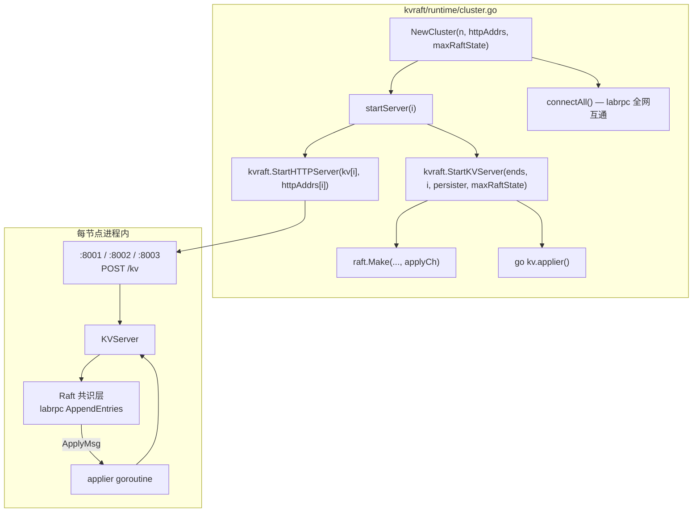
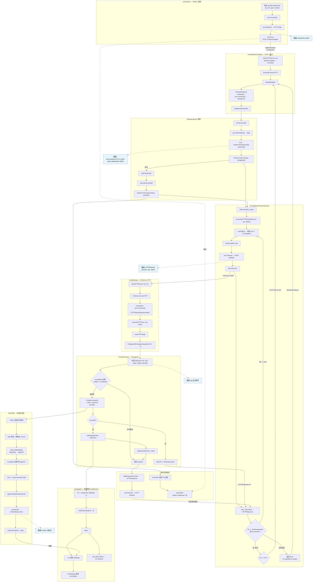
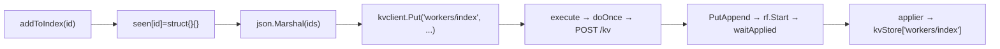
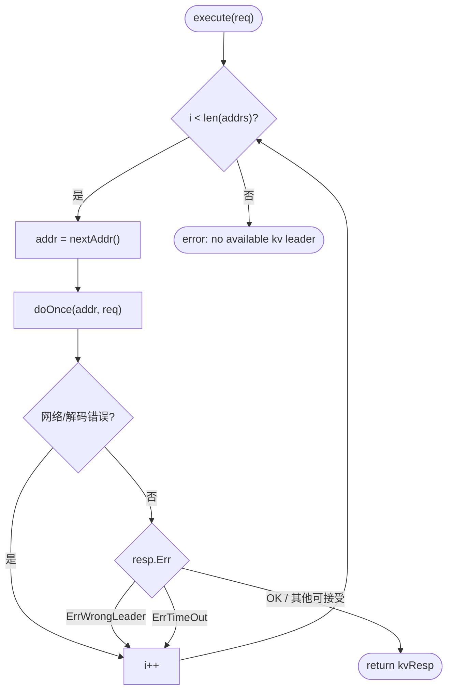
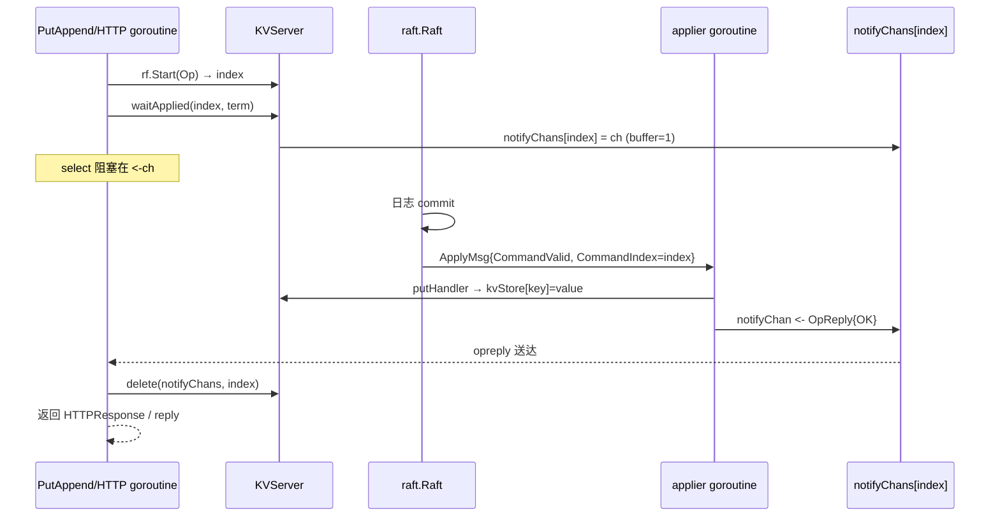

# Phase 1 控制面 — Worker 注册（RegisterWorker）调用与数据流

## 部署拓扑（cluster.go 启动态）

## RegisterWorker 完整链路

## 第二次写入：workers/index（同链路缩写）

## Leader 轮询重试（kvclient.execute）状态机

## waitApplied 与 applier 同步闭环

